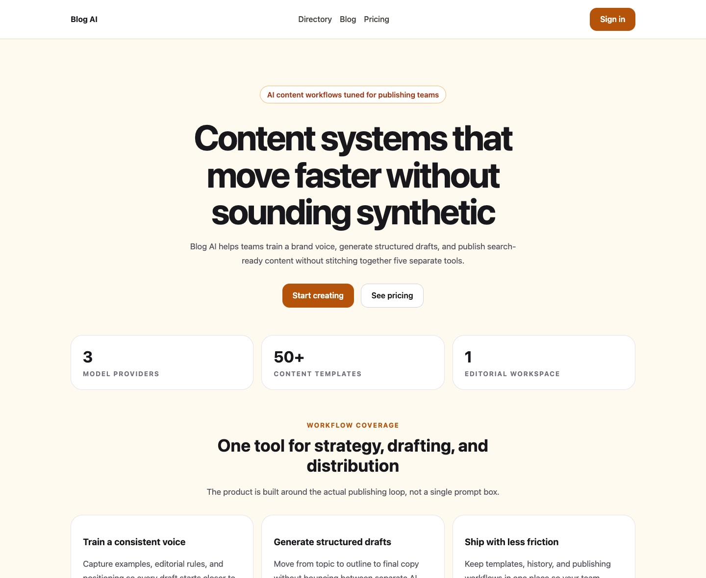

# Blog AI

<p align="center">
  
</p>

<p align="center">
  AI content operations workspace for drafting, brand voice, SEO, analytics, and publishing workflows.
</p>

<p align="center">
  <a href="https://github.com/gr8monk3ys/blog-AI/actions/workflows/ci.yml"></a>
  
  
  
</p>

## Overview

Blog AI combines a Next.js frontend and a FastAPI backend into one workspace for content teams that need more than a prompt box. The product focuses on repeatable publishing: brand voice controls, structured generation, tool-specific workflows, analytics, history, templates, and deployment-ready output.

## Highlights

- Multi-provider generation with OpenAI, Anthropic, and Gemini
- Brand voice training, reusable templates, and content history
- SEO-oriented authoring workflows and analytics views
- Bun-first frontend toolchain with Vitest and Playwright
- Split deployment model: Vercel frontend, containerized backend
- Professional landing page with verified Lighthouse `100/100/100/100`

## Stack

| Layer | Tools |
| --- | --- |
| Frontend | Next.js 16, React 18, TypeScript, Tailwind CSS, Clerk, Sentry |
| Backend | FastAPI, Python 3.12, Neon/Postgres, Redis, Stripe |
| Tooling | Bun, Vitest, Playwright, ESLint, Docker |

## Quick Start

### Prerequisites

- Bun `1.3+`
- Python `3.12+`
- Git
- At least one LLM API key

### 1. Clone and install

```bash
git clone https://github.com/gr8monk3ys/blog-AI.git
cd blog-AI
bun install
```

### 2. Configure environment files

```bash
cp .env.example .env
cp .env.local.example .env.local
```

Set at minimum:

- `OPENAI_API_KEY`
- `NEXT_PUBLIC_API_URL=http://localhost:8000`
- `NEXT_PUBLIC_WS_URL=ws://localhost:8000`

### 3. Start the backend

```bash
cd backend
python -m venv .venv
source .venv/bin/activate
pip install -r requirements.txt
python server.py
```

### 4. Start the frontend

```bash
bun dev
```

Open `http://localhost:3000`.

## Bun Commands

| Command | Purpose |
| --- | --- |
| `bun dev` | Start the Next.js dev server |
| `bun run build` | Build the frontend |
| `bun run start` | Start the production frontend |
| `bun run lint` | Run ESLint |
| `bun run type-check` | Run TypeScript checks |
| `bun run test:run` | Run Vitest once |
| `bun run test:coverage` | Run Vitest with coverage |
| `bun run test:e2e` | Run Playwright end-to-end tests |
| `bun run test:e2e:coverage` | Run the E2E coverage gate |
| `bun run audit:runtime` | Run the Bun-based runtime audit policy |
| `bun run db:migrate` | Apply SQL migrations from `db/migrations/` |

## Backend Commands

| Command | Purpose |
| --- | --- |
| `python server.py` | Start the FastAPI app locally |
| `pytest -q` | Run backend tests |
| `python -m uvicorn server:app --reload` | Local API with autoreload |

## Deployment

- Frontend: Vercel
- Backend: Docker image / container host
- Database: Neon Postgres
- Auth: Clerk

Primary references:

- [Deployment Guide](DEPLOYMENT.md)
- [Vercel + Railway + Neon Guide](docs/DEPLOYMENT_VERCEL_RAILWAY_NEON.md)
- [Environment Reference](docs/ENVIRONMENT.md)
- [Contributing Guide](CONTRIBUTING.md)

## Repository Layout

```text
blog-AI/
├── app/                 Next.js app routes and API handlers
├── backend/             FastAPI app, tests, and Python dependencies
├── components/          React UI components
├── docs/                Architecture and deployment notes
├── e2e/                 Playwright end-to-end tests
├── lib/                 Shared frontend utilities
├── public/              Static assets, including the landing page
├── scripts/             Build, audit, and operational helpers
└── tests/               Additional project test suites
```

## Quality Bar

- `bun run build` passes
- `bun run audit:runtime` passes
- Lighthouse on `/`: `100 / 100 / 100 / 100`
- React Doctor: `100 / 100`

## Notes

- The landing page is served from `public/home.html` through a rewrite in `next.config.mjs` to keep the marketing surface extremely fast.
- The frontend is Bun-first. Legacy alternate lockfiles and stale package-manager instructions are intentionally removed from the active workflow.
