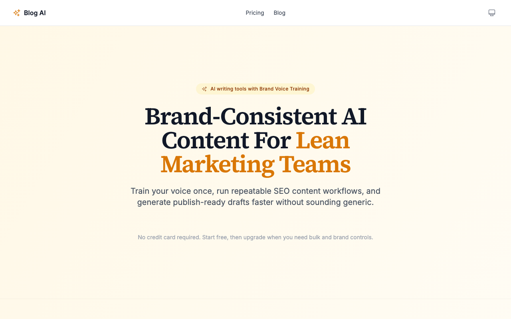

# Blog AI

Generates long-form blog posts and books in a trained brand voice, then publishes them.
Live at https://blog-ai.vivancedata.com. Next.js web app, FastAPI backend, browser extension.

The design decision that matters: generation is a pipeline of small LLM calls, not one
prompt. A post is researched (web search, up to 8 cited sources), outlined, written one
section at a time with the brand voice summary and research context, then proofread and
humanized. Two opt-in stages follow: an SEO loop that rewrites until a score threshold is
met, and a claim-by-claim fact check. Each stage is a plain function in `apps/api/src/` with its own tests, so a bad stage is
diagnosable and swappable. Providers (OpenAI, Anthropic, Gemini) sit behind one
`generate_text()` with retries and per-operation rate limits.



## Layout

```
apps/web/        Next.js 16 app (Clerk auth, Sentry, Neon via route handlers)
apps/api/        FastAPI: app/routes/ are handlers, src/ is the generation logic
apps/extension/  Browser extension
db/migrations/   SQL schema, applied by `bun run db:migrate`
scripts/         migrate, seed, runtime audit, post-deploy health check
```

## Run locally

Needs Bun 1.3+, Python 3.12, and one LLM API key.

```bash
git clone https://github.com/gr8monk3ys/blog-AI.git && cd blog-AI
bun install
cp .env.example .env                       # set OPENAI_API_KEY (or another provider key)
cp .env.local.example apps/web/.env.local  # NEXT_PUBLIC_API_URL=http://localhost:8000

cd apps/api
python -m venv .venv && source .venv/bin/activate
pip install -r requirements.txt
python server.py                           # API on :8000

cd ../.. && bun dev                        # web on :3000
```

Clerk is optional in development: with no `NEXT_PUBLIC_CLERK_PUBLISHABLE_KEY` every route
is public. Without `DATABASE_URL`, history, brand profiles, and analytics fall back to
in-memory storage. See [docs/ENVIRONMENT.md](docs/ENVIRONMENT.md) for the full list.

## Test

```bash
bun run lint && bun run type-check && bun run test:run && bun run build   # web
bun run test:e2e                                                          # Playwright
cd apps/api && DEV_MODE=true OPENAI_API_KEY=test pytest -q                # API
```

CI (`.github/workflows/ci.yml`) runs all of the above plus per-route coverage floors,
a fresh-install migration smoke test, and DB-backed tests against Postgres 16.

## Deploy

Web on Vercel, API as a container (`Dockerfile.backend`, pushed to GHCR by
`.github/workflows/deploy.yml` on green `main`), database on Neon, auth Clerk, billing Stripe.
An hourly workflow checks the deployed site's health. Details in
[docs/DEPLOYMENT.md](docs/DEPLOYMENT.md), schema in [docs/DATABASE.md](docs/DATABASE.md),
HTTP API in [docs/API.md](docs/API.md).

## License

AGPL-3.0. See [LICENSE](LICENSE).
